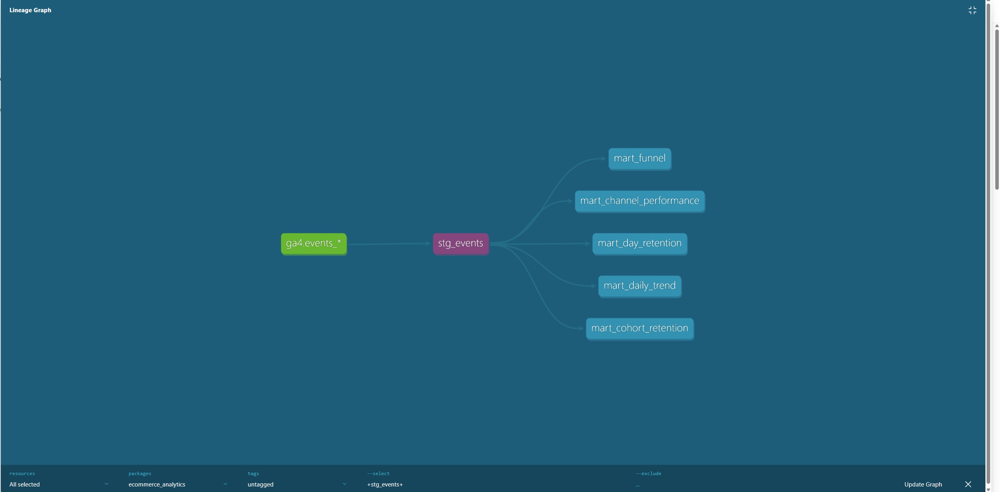

# 📊 Product Behavioral Analytics Pipeline
### Funnel · Cohort Retention · Channel Attribution

An end-to-end analytics pipeline that transforms 4.3M+ raw behavioral events into live product dashboards - giving product, growth, and marketing teams self-serve answers to the questions that drive decisions every week.


---

## 🧭 Project Overview
Every product and growth team faces the same foundational challenge, how do you turn millions of raw behavioral events into decisions that actually move the business?

This project answers that question across three dimensions: where users drop off, whether they come back, and which channels are worth investing in.

Using 4.3M+ GA4 behavioral events from Google's merchandise store, it surfaces the conversion, retention, and attribution insights that product and growth teams rely on to prioritise roadmap decisions, 
backed by clean, tested, and documented data models.

---

## 📌 The Business Problem
Every ecommerce product and growth team must constantly answer the same questions:

- Where exactly are users dropping out of the purchase funnel - and why?
- Which acquisition channels bring users who actually convert and return?
- Are we building a loyal user base, or just acquiring one-time visitors?
- How do seasonal traffic spikes affect long-term retention and revenue quality?

**The Core Problem Being Solved**

*"Most companies collect millions of behavioral events through GA4 but have no reliable infrastructure to turn raw event logs into consistent product insights. Without a structured pipeline, answering basic product questions requires custom SQL every time, produces inconsistent metric definitions across teams, and gives leadership no single source of truth."*

## Business Questions This Project Answers

| Business Question | Method |
|------------------|--------|
| Where does the purchase funnel lose users? | 6-stage funnel model · unique users per stage |
| Which traffic channels drive the most conversions and revenue? | Channel attribution model · conversion rate + LTV by source/medium |
| Are users coming back after their first visit? | Weekly cohort retention model · 14 cohorts |
| How quickly do users return and which cohorts retain best? | D7 / D30 / D60 day-level retention milestones |
| How did traffic and conversion trend over the 92-day period? | Daily trend model · dual-axis time series |

---

## ⚡Key Findings

| Finding                             | Metric                                       | Business Signal                                  |
| ----------------------------------- | -------------------------------------------- | ------------------------------------------------ |
| 🚨 Funnel collapses before checkout | 77% of visitors never view a product         | Discovery is the problem, not payment flow      |
| 🎯 Organic search dominates         | $95K revenue · 1.19% conversion · 103K users |Organic search is both the largest acquisition channel and the highest-performing source of qualified traffic|
| 💸 Paid search underperforms        | 0.98% conversion · $59/buyer vs $77 organic  | Organic delivers 1.3x higher LTV than CPC        |
| 📉 Retention is structurally low    | D7 never exceeds 12% across any cohort       | Site acquires visitors, but struggles to drive repeat engagement and customer loyalty|
| 🗓️ Cohort quality varies 2x        | Nov organic: 12% D7 · Dec seasonal: 6% D7    | Promo acquisition doesn't build loyalty          |
| 🎄 Seasonality drives conversion    | Peak 3.17% Nov 30 · Post-Christmas cliff <1% | Holiday intent spike, not sustainable conversion |
| ⚠️ Attribution gap is large         | ~30% of revenue ($108K) is unattributed  | UTM tagging gaps hiding true channel ROI         |


---

## ✅ Business Recommendations

1. **Fix product discovery before checkout -** The funnel loses 77% of users before a product is even viewed. A/B test homepage merchandising, search relevance, and category navigation. A 10% improvement in page_view → view_item conversion would add 500 purchasers based on current funnel ratios.

2. **Reallocate Google CPC budget -** Paid search has the lowest conversion rate (0.98%) and lowest average spend per buyer ($59.56) of all named channels. Google Organic delivers better results organically. Reallocate paid budget toward retention or referral programs.

3. **Build a D7 re-engagement program targeting organic cohorts -** November organic cohorts retain at 2x the rate of any other segment. These are the site's most loyal users yet even they drop below 12% by day 7. A targeted email or push sequence for users who visit but don't return within 7 days, focused on organic acquisition segments, represents the highest-ROI retention investment available in this data.


---

## ⚠️ Data Limitations

| Limitation                                                               | Impact on Analysis                                                                                                                        |
| ------------------------------------------------------------------------ | ----------------------------------------------------------------------------------------------------------------------------------------- |
| **Dataset spans only 92 days (Nov 1 – Jan 31)**                          | Later cohorts lack sufficient observation time for reliable D30 and D60 retention analysis.                                               |
| **Publicly available, obfuscated dataset**                               | Revenue values and user identifiers are anonymized; findings should be interpreted as directional rather than auditable business metrics. |
| **No session-level conversion tracking available**                       | Funnel analysis is based on unique users at each stage and does not represent a true sequential conversion funnel.                        |
| **`user_pseudo_id`is a browser cookie, not a person**                    | Multi-device users inflate unique user counts · retention rates are overstated · production systems use authenticated `user_id`                                   |
| **~30% of traffic is categorized as `(data deleted)` or `<Other>`**      | Marketing channel attribution is incomplete, limiting the accuracy of traffic source analysis.                                            |

---

## 🏗️ Architecture
```
bigquery-public-data.ga4_obfuscated_sample_ecommerce.events_*
                              │
                              ▼
                        stg_events                    ← staging layer
                   ┌──────────┼──────────┐              flatten arrays
                   │          │          │              fix revenue types
                   ▼          ▼          ▼              extract structs
            mart_funnel  mart_channel  mart_daily
                         _performance  _trend
                   │
          ┌────────┴────────┐
          ▼                 ▼
  mart_cohort_        mart_day_
  retention           retention
                              │
                              ▼
                       Looker Studio
                    3-page live dashboard
```
**Core design decision:** `stg_events` is the single source of truth. All five mart models reference it - never the raw GA4 table. GA4's schema complexity is handled exactly once. Adding a new mart model requires zero additional unnesting logic.

---

## 📊 Dashboard — 3 Pages

| Page                    | Visuals                                                                                      | Answers                                                          |
| ----------------------- | -------------------------------------------------------------------------------------------- | ---------------------------------------------------------------- |
| **Overview & Funnel**   | 4 KPI scorecards · 6-stage funnel · 92-day dual-axis trend                                   | Where does the funnel break? How did the site perform over time? |
| **Channel Performance** | Conversion rate bar chart · Revenue horizontal bar · Full attribution table with color scale | Which channels drive volume? Which drive value?                  |
| **Retention Analysis**  | 14-cohort weekly heatmap · D7/D30/D60 grouped bar chart                                      | Are users coming back? Which cohorts are most loyal?             |


 ## 🗂️ Data Lineage

 Full dbt DAG showing data flow from raw GA4 source → staging models → final analytics marts.
 


---

## 📦 Dataset

**Source:** `bigquery-public-data.ga4_obfuscated_sample_ecommerce.events_*`  
Google’s publicly available obfuscated GA4 sample dataset - real event structure with anonymised identifiers.

| Metric | Value |
|--------|-------|
| **Period** | Nov 1, 2020 – Jan 31, 2021 |
| **Duration** | 92 days |
| **Raw events** | ~4.3M |
| **Unique users** | 269,792 |
| **Purchasers** | 4,419 |
| **Overall conversion rate** | 1.64% |
| **Total tracked revenue** | $362,203 |
| **Traffic channels** | 9 |
| **Weekly cohorts** | 14 |
| **Event types** | 17 |

